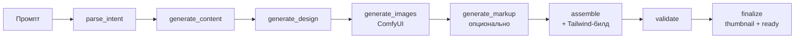
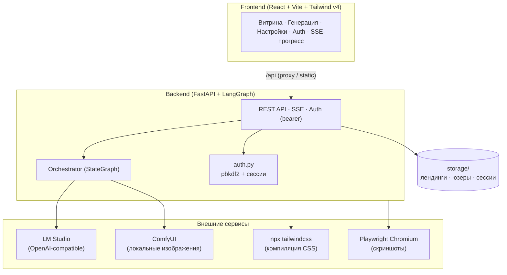

# Landing Generator

Генератор лендингов на локальном AI-стеке: текстовый промпт → LLM (LM Studio) → ComfyUI (изображения) → готовая статическая страница с настоящим Tailwind-билдом.

## Возможности

- **Полный пайплайн на LangGraph**: анализ промпта → контент → дизайн-токены → изображения (ComfyUI) → LLM-разметка (опционально) → сборка → валидация
- **Настоящие изображения**: локальная генерация через ComfyUI (любой workflow, UI- или API-формат), WebP-оптимизация, base64-встраивание
- **Компилированный Tailwind**: `styles.css` ~10KB вместо Play CDN (production-ready ZIP, работает офлайн)
- **AI-дизайнер разметки**: LLM пишет HTML секций сам (эксперимент, с санитайзером и fallback на шаблоны)
- **Пользователи**: регистрация, авторы на витрине, черновики + публикация по кнопке, права владельца
- **Прозрачность**: модель, промпт, полные тексты скиллов, палитра — блок «Как сгенерирован»
- **Регенерация**: отдельных секций (текст) и изображений (секция/карточка)
- **Превью витрины**: Playwright-скриншоты с трёхуровневым fallback

## Архитектура





Гарантии: глобальный GPU-lock (одна генерация за раз на V100), watchdog зависших генераций при старте, whitelist путей воркфлоу, allowlist-санитайзер LLM-разметки, fallback на каждом этапе (нет ComfyUI → стоковые картинки; нет npm → Tailwind CDN; сбой секции → шаблонный рендер).

## Требования

- Python 3.10+ (тестировалось на 3.14)
- Node.js + npm (для фронтенда и компиляции Tailwind)
- [LM Studio](https://lmstudio.ai/) с загруженной моделью (сервер на `:1234`)
- [ComfyUI](https://www.comfy.org/) с txt2img workflow (порт `:8188`)
- Chromium для Playwright: `python -m playwright install chromium`

## Установка

```bash
# Backend
cd backend
python -m pip install -r requirements.txt
python -m playwright install chromium
copy .env.example .env   # и заполнить при необходимости

# Frontend
cd ../frontend
npm install
```

## Запуск

**Разработка:**
```bash
# Терминал 1
cd backend
python -m uvicorn app.main:app --reload --port 8000

# Терминал 2
cd frontend
npm run dev          # http://localhost:5173, /api проксируется на :8000
```

**Продакшен (один origin):**
```bash
cd frontend && npm run build   # соберёт dist/
cd ../backend && python -m uvicorn app.main:app --port 8000
# http://127.0.0.1:8000 раздаёт SPA + API одновременно
```

## Конфигурация (.env)

| Переменная | По умолчанию | Описание |
|---|---|---|
| `LM_STUDIO_URL` | `http://localhost:1234/v1` | Эндпоинт LM Studio |
| `OPENAI_API_KEY` | — | Fallback на облако при сбое локальной модели |
| `COMFYUI_URL` | `http://127.0.0.1:8188` | ComfyUI API |
| `COMFYUI_MODEL` | — | Имя checkpoint (обычно задаётся в workflow-файле) |
| `COMFYUI_WORKFLOW_PATH` | встроенный шаблон | Путь к твоему txt2img workflow (UI/API формат) |
| `COMFYUI_WORKFLOWS_ROOT` | `templates/workflows` | **Whitelist**: пути воркфлоу разрешены только внутри этого каталога |
| `IMAGE_GENERATION_ENABLED` | `true` | Генерация изображений вкл/выкл |
| `IMAGE_DEFAULT_STEPS` | `8` | Шаги сэмплинга (настраивается и в UI) |
| `TAILWIND_BUILD_ENABLED` | `true` | Компилировать CSS через npm вместо CDN |
| `SERVE_FRONTEND` | `true` | Раздавать `frontend/dist` из бэкенда |
| `GENERATION_QUEUE_TIMEOUT` | `900` | Макс. ожидание GPU-слота, сек |

## Тесты

```bash
cd backend
python -m pytest -q          # 105+ тестов: конвертер workflow, API, auth, билд, санитайзер

cd ../frontend
npm run build                # typecheck + сборка
```

## Запуск в Docker (VDS)

Контейнер содержит бэкенд + собранный фронтенд + Node (настоящий Tailwind-билд) + Chromium (скриншоты). LLM и ComfyUI остаются снаружи — укажи их адреса через переменные.

```bash
# На VDS (или локально с Docker):
docker compose up -d --build
# Приложение: http://<ip-vds>:8000

# Свои адреса LLM/ComfyUI (например GPU-машина дома через Tailscale/WireGuard):
LM_STUDIO_URL=http://100.x.y.z:1234/v1 COMFYUI_URL=http://100.x.y.z:8188 docker compose up -d --build

# Или без локального LLM вообще — только OpenAI:
OPENAI_API_KEY=sk-... LM_STUDIO_URL=https://api.openai.com/v1 docker compose up -d --build
```

Примечания:
- Данные (лендинги, юзеры, сессии, логи) живут в Docker-томе `lg-data` → переживают пересборку контейнера
- `host.docker.internal:host-gateway` на Linux позволяет контейнеру ходить к сервисам на самом VDS-хосте
- Если ComfyUI недоступен — изображения автоматически заменяются стоковыми, генерация не падает
- Кастомные воркфлоу в контейнере: скопируй JSON внутрь образа (или собери свой образ с ними) — whitelist разрешает только `/app/templates/workflows`

## Структура

```
backend/
  app/
    api/routes/      # auth, landings, generate, skills, models
    core/            # orchestrator (LangGraph), llm, gpu_lock, progress, watchdog
    engine/          # content, design, nlp_parser, image_generator, assembler,
                     # tailwind_builder, thumbnails, validator, sanitize
    mcp/             # ComfyUI API-клиент, конвертер workflow, MCP-сервер/клиент
    models/          # Pydantic-схемы
    storage/         # файловое хранилище (landings, skills, users)
  tests/
frontend/
  src/pages/         # Catalog, LandingDetail, Generate, NotFound
  src/components/    # Header, AuthModal, SettingsModal, SkillsManager, ...
templates/
  landing.html       # Jinja2-шаблон страницы
  workflows/         # txt2img.json (дефолтный workflow)
```

## Настройка ComfyUI workflow

В настройках приложения укажи путь к своему `txt2img` (JSON). Поддерживаются оба формата экспорта ComfyUI — конвертер сам разворачивает UI-формат (включая сабграфы) в API-формат. Пайплайн подставляет только: промпт, размеры (кратные 64), seed и steps — `cfg`, sampler, scheduler и остальное берутся из твоего workflow как есть.
